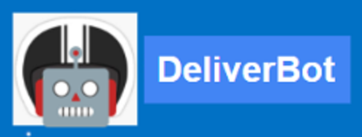
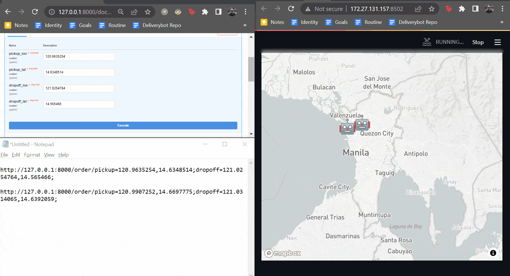

<!--
Hey, thanks for using the awesome-readme-template template.  
If you have any enhancements, then fork this project and create a pull request 
or just open an issue with the label "enhancement".

Don't forget to give this project a star for additional support ;)
Maybe you can mention me or this repo in the acknowledgements too
-->
<div align="center">

  
  <h1>DeliveryBot</h1>
  
  <p>
    Turning robots into couriers 
  </p>
  
  
<!-- Badges -->
<p>
  <a href="https://github.com/ncdejito/dbot-learn/graphs/contributors">
    
  </a>
  <a href="https://github.com/ncdejito/dbot-learn/graphs/contributors">
    
  </a>
  <a href="">
    
  </a>
  <a href="https://github.com/ncdejito/dbot-learn/network/members">
    
  </a>
  <a href="https://github.com/ncdejito/dbot-learn/stargazers">
    
  </a>
  <a href="https://github.com/ncdejito/dbot-learn/issues/">
    
  </a>
  <a href="https://github.com/ncdejito/dbot-learn/blob/master/LICENSE">
    
  </a>
</p>
   
<h4>
    <a href="https://github.com/ncdejito/dbot-learn/">View Demo</a>
  <span> · </span>
    <a href="https://github.com/ncdejito/dbot-learn">Documentation</a>
  <span> · </span>
    <a href="https://github.com/ncdejito/dbot-learn/issues/">Report Bug</a>
  <span> · </span>
    <a href="https://github.com/ncdejito/dbot-learn/issues/">Request Feature</a>
  </h4>
</div>

<br />

<!-- Table of Contents -->
# :notebook_with_decorative_cover: Table of Contents

- [About the Project](#star2-about-the-project)
  * [Screenshots](#camera-screenshots)
  * [Tech Stack](#space_invader-tech-stack)
  * [Features](#dart-features)
  * [Color Reference](#art-color-reference)
  * [Environment Variables](#key-environment-variables)
- [Getting Started](#toolbox-getting-started)
  * [Prerequisites](#bangbang-prerequisites)
  * [Installation](#gear-installation)
  * [Running Tests](#test_tube-running-tests)
  * [Run Locally](#running-run-locally)
  * [Deployment](#triangular_flag_on_post-deployment)
- [Usage](#eyes-usage)
- [Roadmap](#compass-roadmap)
- [Contributing](#wave-contributing)
  * [Code of Conduct](#scroll-code-of-conduct)
- [FAQ](#grey_question-faq)
- [License](#warning-license)
- [Contact](#handshake-contact)
- [Acknowledgements](#gem-acknowledgements)

  

<!-- About the Project -->
## :star2: About the Project

<!-- Usage -->
## :eyes: Usage

Input pickup and dropoff location with API call below, then watch it appear at client http://172.27.131.157:8501/
```bash
http://127.0.0.1:8000//order/pickup={pickup_lon},{pickup_lat};dropoff={dropoff_lon},{dropoff_lat};
```




<!-- Features -->
### :dart: Features

- Order taking via API
- Dispatching with logs
- Frontend for monitoring movement


<!-- Traits -->
### :camera: Traits

 - Resilient
 - Scalable
 - Cost-aware


<!-- TechStack -->
### :space_invader: Tech Stack

<details>
  <summary>Client</summary>
  <ul>
    <li><a href="https://streamlit.io/">Streamlit</a></li>
  </ul>
</details>

<details>
  <summary>Server</summary>
  <ul>
    <li><a href="https://fastapi.tiangolo.com/">FastAPI</a></li>
    <li><a href="https://www.rabbitmq.com/">RabbitMQ (WIP)</a></li>
  </ul>
</details>

<details>
<summary>Database</summary>
  <ul>
    <li><a href="https://redis.io/">Redis (WIP)</a></li>
  </ul>
</details>

<details>
<summary>DevOps</summary>
  <ul>
    <li><a href="https://www.docker.com/">Docker (WIP)</a></li>
    <li><a href="https://www.docker.com/">Kubernetes (WIP)</a></li>
    <li><a href="https://www.docker.com/">Terraform (WIP)</a></li>
  </ul>
</details>


<!-- Env Variables -->
<!-- ### :key: Environment Variables

To run this project, you will need to add the following environment variables to your .env file

`API_KEY`

`ANOTHER_API_KEY` -->

<!-- Getting Started -->
## 	:toolbox: Getting Started

<!-- Prerequisites -->
### :bangbang: Prerequisites

This project uses poetry as package manager

```bash
 pip install poetry
```

<!-- Installation -->
### :gear: Installation

Install project with poetry

```bash
  cd dbot-learn
  poetry install
```
   
<!-- Running Tests -->
### :test_tube: Running Tests

To run tests, run the following command

```bash
  pytest
```

<!-- Run Locally -->
### :running: Run Locally

Clone the project

```bash
  git clone https://github.com/ncdejito/dbot-learn.git
```

Go to the project directory

```bash
  cd dbot-learn
```

Install dependencies

```bash
  poetry shell
```

Start the server

```bash
  make run_api
```

Start the client

```bash
  make run_client
```

<!-- Deployment -->
<!-- ### :triangular_flag_on_post: Deployment

To deploy this project run

```bash
  yarn deploy
``` -->


<!-- Roadmap -->
## :compass: Roadmap

* [x] Minimum working example
* [ ] Microservices setup


<!-- Contributing -->
## :wave: Contributing

<a href="https://github.com/ncdejito/dbot-learn/graphs/contributors">
  
</a>


Contributions are always welcome!

See `contributing.md` for ways to get started.


<!-- Code of Conduct -->
### :scroll: Code of Conduct

Please read the [Code of Conduct](https://github.com/ncdejito/dbot-learn/blob/master/CODE_OF_CONDUCT.md)

<!-- FAQ -->
## :grey_question: FAQ

- Why?

  + Because

- How?

  + Try


<!-- License -->
## :warning: License

Distributed under the no License. See LICENSE.txt for more information.


<!-- Contact -->
## :handshake: Contact

Niccolo Dejito - [@twitter_handle](https://twitter.com/ncdejito) - ncdejito@gmail.com

Project Link: [https://github.com/ncdejito/dbot-learn](https://github.com/ncdejito/dbot-learn)


<!-- Acknowledgments -->
## :gem: Acknowledgements

Use this section to mention useful resources and libraries that you have used in your projects.

 - [Awesome Readme Template by Louis3797](https://github.com/Louis3797/awesome-readme-template)
